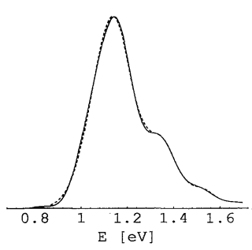

# NOCl Photodissociation Spectrum Calculation

This repository provides a Python-based program to calculate the photodissociation spectrum of Nitrosylchlorid (NOCl). The three degrees of freedom of NOCl are modeled via a harmonic oscillator for the vibration, rigid rotor for angular rotation, and a FFT scheme in the dissociative coordinate. Jacobi coordinates are used to model NOCl.

Solving the ground state and time propagation for a single coordinate is straightforward, but the algorithmic complexity and computational cost increases drastically with correlated multiple dimensions. This makes direct H-matrix generation and diagonalization infeasible, requiring numerical methods like the lanczos algorithm instead.

## Features

The program simulates the photodissociation spectrum by:
1. **Modeling NOCl in 3 Degrees of Freedom:**
   - **NO Vibration:** Treated as a harmonic oscillator.
   - **Angular Rotation:** Modeled as a rigid rotor, represented by Legendre polynomials.
   - **Cl Dissociation:** Simulated using a Fast Fourier Transform (FFT) scheme.

2. **Computing the Ground State Wave Function:**
   - Solves the 3D ground state wave function of NOCl. This step is generalizable to higher-dimensional problems (n-D).

3. **Wave Function Excitation to the Excited State and time propagation of the excited state:**
   - Excites the ground state wave function to simulate absorption processes.
   - Propagates the wave function in the excited state over a period of 48 femtoseconds.

4. **Spectrum Generation:**
   - Derives the photodissociation spectrum through a Fourier transform of the time-propagated overlap data.

## Installation

Clone the repository to get started:

```bash
git clone https://github.com/yourusername/nocl-photodissociation.git
cd nocl-photodissociation
```

## Usage

The main program is `nocl.py`, which performs the following tasks in sequence:

1. Initializes the NOCl molecular model with the appropriate DOF.
2. Solves for the ground state wave function.
3. Excites the ground state wave function and propagates it over 48 fs.
4. Computes the photodissociation spectrum through a Fourier transformation.

To run the program, execute:

```bash
python nocl.py
```

To perform the fourier transform to generate the spectrum data, execute:

```bash
python fft.py
```

### Output

The program will output the photodissociation spectrum of NOCl, providing a visualization of the frequency distribution resulting from the overlap of the wave functions during time propagation.

## Requirements

- Python 3.x
- [NumPy](https://numpy.org/)
- [SciPy](https://scipy.org/)
- [Matplotlib](https://matplotlib.org/) (for optional visualization)

Install dependencies with:

bashi
pip install numpy scipy matplotlib
bashi

## Theory

This simulation models the dissociation process by treating NOCl's three main degrees of freedom separately:
- **Vibrational Motion** is modeled as a harmonic oscillator.
- **Rotational Motion** is modeled with Legendre polynomials
- **Dissociative Motion** is modelled with a fft scheme

From this model, the program calculates the ground state, excites it to simulate photonic absorption, and propagates the wave function in the excited state for 48 fs. The spectrum is extracted via Fourier transformation of the time-dependent overlap, revealing the photodissociation characteristics.

An iterative Lanczos algorithm is used to avoid the prohibitively expensive H-matrix diagonalization.

## Result



The resulting photodissociation spectrum. The dashed line refers to exact data.